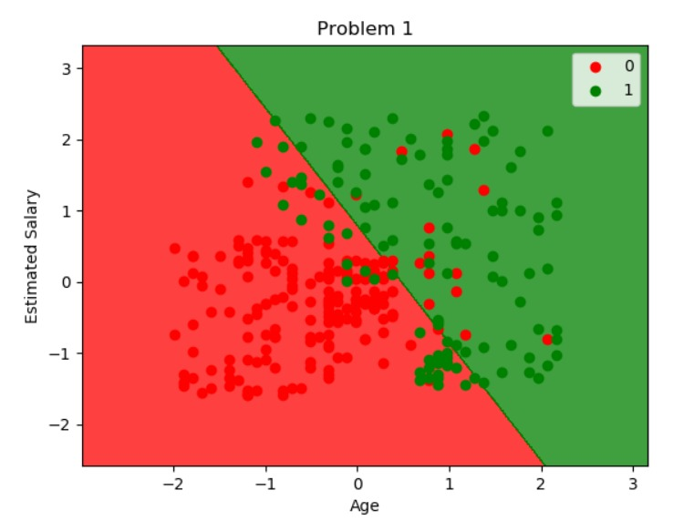

# curneu_task
A classification model is done for social network
ads dataset. 

Dataset description
This project contains 400 data entries. 

Attributes of the data include:

1.User ID 

2.Gender 	

3.Age 	

4.Estimated salary 	

5.Purchased

Building a Model

In machine learning, support-vector machines are 
supervised learning models with associated learning
algorithms that analyze data used for classification 
and regression analysis. 

Therefore, SVM classification model is used to 
classify based on the target variable - Purchased. 
This model is implemented by using python. 
 
Training and testing the data
Train-test split : 75-25.

Here 300 entries are trained and 
100 entries are validated. 

Why Support vector machine classifier? 

1.SVM works relatively well when there is a clear 
margin of separation between classes. 

2.SVM is more effective in high dimensional spaces.

3.SVM is effective in cases where the number of
dimensions is greater than the number of samples.

4.SVM is relatively memory efficient. 

Libraries used

1.Numpy 
2.Matplotlib
3.Sklearn

Performance Measure

Here, accuracy is measured by using Confusion matrix.
	
| Accuracy      | Predicted (purchased) |  Predicted (Not purchased)  |
| ------------- | --------------------- | --------------------------  |
|  Purchased    |          66           |           2                 |
| Not purchased |           8           |           24                |

Hence 90% accuracy is achieved using this SVM model.

Visualization
Output is visualized by using matplotlib library. 

